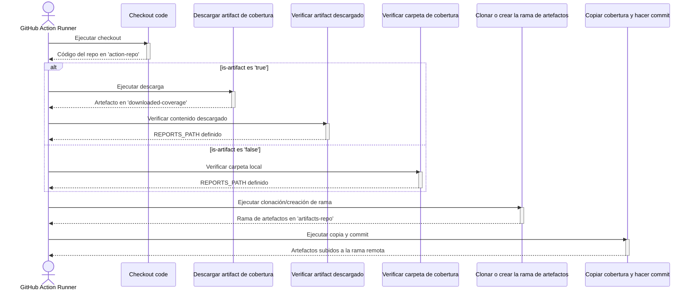

# Git Archive Action

## Idiomas
- [Ingles](README.md)
- [Español](README.es.md)

## 📘 1. ¿Qué hace esta Action?

Esta GitHub Action está diseñada para persistir artefactos de un workflow, como reportes de cobertura de pruebas, en una rama de Git dedicada dentro del mismo repositorio. Su propósito principal es desacoplar el almacenamiento de artefactos del historial principal del código, manteniendo un registro histórico y accesible de los resultados de cada ejecución.

### Funcionamiento técnico:

**Obtención de los Reportes:** La Action puede obtener los reportes de dos maneras distintas, controladas por el input `is-artifact`:

- **Desde una carpeta local:** Si `is-artifact` es `false`, la Action busca los reportes en una ruta específica dentro del workspace del runner.
- **Desde un artefacto de GitHub:** Si `is-artifact` es `true`, la Action primero descarga un artefacto de GitHub (previamente subido en un job anterior) que contiene los reportes.

**Gestión de la Rama de Artefactos:** La Action interactúa con una rama específica (por defecto `artifacts`):

- Si la rama no existe en el repositorio remoto, la crea como una rama huérfana (sin historial común con otras ramas) y le añade un commit inicial.
- Si la rama ya existe, la clona en un directorio aislado.

**Almacenamiento Estructurado:** Una vez que tiene los reportes y la rama de artefactos lista, la Action copia los archivos de los reportes dentro de la rama clonada, siguiendo una estructura de carpetas organizada por rama y commit:

- `{nombre-rama-origen}/{hash-commit}/`: Guarda una copia histórica de los artefactos para ese commit específico.
- `{nombre-rama-origen}/latest/`: Guarda una copia que siempre refleja los últimos artefactos generados para esa rama.

**Commit y Push:** Finalmente, realiza un commit con todos los nuevos artefactos y lo sube a la rama de artefactos remota.

Este mecanismo es útil en escenarios de CI/CD para almacenar y visualizar la evolución de la calidad del código (cobertura, pruebas, etc.) sin saturar el historial de código fuente principal.

## ⚙️ 2. Inputs Requeridos

A continuación se detallan los parámetros de entrada que la Action utiliza.

| Nombre del input | ¿Requerido? | Valor por defecto | Descripción técnica |
|------------------|-------------|-------------------|---------------------|
| `gh-token` | ✅ | N/A | Token de GitHub (GITHUB_TOKEN) con permisos de escritura para poder clonar y hacer push a la rama de artefactos. |
| `artifacts-branch` | ❌ | `artifacts` | El nombre de la rama de Git que se usará para almacenar los artefactos. |
| `coverage-source` | ❌ | `coverage-reports` | Si `is-artifact` es `false`, es la ruta a la carpeta que contiene los reportes. Si es `true`, es el nombre del artefacto de GitHub que se debe descargar. |
| `is-artifact` | ❌ | `false` | Un booleano (true/false) que indica cómo interpretar `coverage-source`. Si es `true`, se descarga un artefacto. Si es `false`, se copia una carpeta local. |

## 🔑 3. Permisos Requeridos

Para que esta Action pueda hacer push a la rama de artefactos, el workflow que la utiliza debe tener permisos de escritura sobre el contenido del repositorio. Debes agregar el siguiente bloque `permissions` al inicio de tu archivo de workflow:

```yaml
permissions:
  contents: write
```

## 📈 4. Diagrama secuencial paso a paso

El siguiente diagrama ilustra el flujo de ejecución de la Action, mostrando la lógica condicional para manejar los reportes.



## 🧠 5. Algoritmo detallado

A continuación se describe el proceso que realiza la Action, paso por paso.

### 1. Checkout code (Hacer checkout del código)

Utiliza la action `actions/checkout@v3` para clonar el repositorio actual en una subcarpeta llamada `action-repo`.

### 2. Descargar artifact de cobertura

**Condición:** Este paso solo se ejecuta si `inputs.is-artifact` es `'true'`.

Utiliza la action `actions/download-artifact@v4` para descargar el artefacto cuyo nombre coincide con `inputs.coverage-source`.

El contenido del artefacto se guarda en una nueva carpeta llamada `downloaded-coverage`.

### 3. Verificar artifact descargado de cobertura / Verificar carpeta de cobertura

Se ejecuta uno de estos dos pasos dependiendo del valor de `inputs.is-artifact`.

- **Si es `true`:** Verifica que la carpeta `downloaded-coverage` no esté vacía. Si es válida, exporta la ruta absoluta a esta carpeta a la variable de entorno `REPORTS_PATH`.
- **Si es `false`:** Verifica que la carpeta especificada en `inputs.coverage-source` exista dentro del workspace y no esté vacía. Si es válida, exporta su ruta absoluta a la variable de entorno `REPORTS_PATH`.

Si alguna de las carpetas no existe o está vacía, la Action falla.

### 4. Clonar o crear la rama de artefactos

- Configura las credenciales de Git para actuar como un bot (`github-actions[bot]`).
- Usa `git ls-remote` para verificar si la rama definida en `inputs.artifacts-branch` ya existe en el repositorio remoto.

**Si la rama existe:** La clona (solo esa rama) en un nuevo directorio llamado `artifacts-repo`.

**Si la rama no existe:**
- Crea el directorio `artifacts-repo` e inicializa un nuevo repositorio de Git dentro.
- Crea una rama huérfana (`--orphan`) con el nombre especificado.
- Realiza un commit inicial vacío para poder hacer push.
- Agrega el remote origin y hace push para crear la rama en el repositorio remoto.

### 5. Copiar cobertura y hacer commit

- Verifica que la variable `REPORTS_PATH` fue definida correctamente en los pasos anteriores.
- Se posiciona dentro de la carpeta `artifacts-repo`.
- Crea la estructura de directorios de destino: `./${BRANCH_NAME}/${COMMIT_ID}` y `./${BRANCH_NAME}/latest`.
- Copia recursivamente todo el contenido de la carpeta de origen (`REPORTS_PATH`) a las dos carpetas de destino recién creadas.
- Crea o sobrescribe un archivo `README.md` en la raíz de `artifacts-repo`.
- Añade todos los archivos nuevos y modificados al área de staging de Git (`git add .`).
- Realiza un `git commit` con un mensaje descriptivo que incluye el hash del commit y el nombre de la rama que originaron los artefactos.
- Finalmente, ejecuta `git push` para subir todos los cambios a la rama de artefactos remota.

## 🚀 6. Ejemplos de Uso
A continuación se presentan dos escenarios de uso común, explicados en detalle para facilitar su implementación.

### Ejemplo 1: Guardar Reportes desde una Carpeta Local
Este es el caso más sencillo. El workflow realiza pruebas, genera los reportes de cobertura en una carpeta y, en el mismo job, utiliza esta Action para subir esa carpeta a la rama de artefactos.

#### Configuración del Workflow
```yaml
name: CI con Reportes de Cobertura

on:
  push:
    branches:
      - main

# 1. Permisos
permissions:
  contents: write

jobs:
  # 2. Definición del Job
  test-and-save-coverage:
    runs-on: ubuntu-latest
    steps:
      # 3. Checkout del código
      - name: Checkout del código
        uses: actions/checkout@v3

      # 4. Generación de reportes (simulada)
      - name: Generar reportes de cobertura
        run: |
          mkdir -p coverage-reports
          echo "<h1>Coverage: 100%</h1>" > coverage-reports/index.html

      # 5. Uso de la Action para guardar los reportes
      - name: Guardar Reportes de Cobertura
        uses: tu-usuario/tu-repositorio-action@v1 # ¡Reemplaza con tu Action!
        with:
          gh-token: ${{ secrets.GITHUB_TOKEN }}
          coverage-source: 'coverage-reports'
          is-artifact: 'false'
```

#### Explicación Detallada
- **permissions**: Se establece `contents: write` a nivel de workflow. Esto es obligatorio para otorgar al `GITHUB_TOKEN` el permiso de escribir (hacer push) en el repositorio, que es lo que nuestra Action necesita para subir la rama de artefactos.

- **jobs: test-and-save-coverage**: Se define un único job que se ejecutará en un runner de `ubuntu-latest`.

- **Checkout del código**: El primer paso es siempre clonar el código del repositorio en el runner para que los siguientes pasos puedan trabajar con él.

- **Generar reportes de cobertura**: Este paso `run` simula el proceso de pruebas. Aquí es donde iría tu comando real (ej. `npm test -- --coverage`, `pytest --cov`, etc.). El resultado importante es que se crea una carpeta llamada `coverage-reports` con el reporte (en este caso, un `index.html`).

- **Guardar Reportes de Cobertura**: Aquí se ejecuta nuestra Action.
  - `uses`: Debes reemplazar `tu-usuario/tu-repositorio-action@v1` con la referencia correcta a tu Action.
  - `with`: Se configuran los inputs de la Action:
    - `gh-token: ${{ secrets.GITHUB_TOKEN }}`: Se pasa el token de GitHub de forma segura. Este token ya tiene los permisos de escritura que definimos en el paso 1.
    - `coverage-source: 'coverage-reports'`: Le indicamos a la Action que la fuente de los reportes es la carpeta `coverage-reports`, la misma que creamos en el paso anterior.
    - `is-artifact: 'false'`: Le decimos a la Action que no debe descargar ningún artefacto, sino que debe buscar una carpeta local en la ruta especificada en `coverage-source`.

### Ejemplo 2: Guardar Reportes desde un Artefacto de GitHub
Este escenario es más complejo y se usa cuando los reportes se generan en un job y se necesitan consumir en otro. El primer job genera los reportes y los sube como un "artefacto temporal" de GitHub. El segundo job depende del primero, descarga ese artefacto y luego usa nuestra Action para guardarlo permanentemente en la rama.

#### Configuración del Workflow
```yaml
name: CI con Artefactos de Cobertura

on:
  push:
    branches:
      - main

permissions:
  contents: write

jobs:
  # 1. Primer Job: Generar y subir artefacto
  build-and-test:
    runs-on: ubuntu-latest
    steps:
      - name: Checkout del código
        uses: actions/checkout@v3

      - name: Generar reportes
        run: |
          mkdir -p reports
          echo "<h1>Coverage Report</h1>" > reports/index.html
          
      - name: Subir artefacto de cobertura
        uses: actions/upload-artifact@v4
        with:
          name: coverage-artifact
          path: reports/

  # 2. Segundo Job: Guardar el artefacto en la rama
  save-artifacts:
    runs-on: ubuntu-latest
    needs: build-and-test # 3. Dependencia de jobs
    steps:
      - name: Guardar Artefacto de Cobertura en Rama
        uses: tu-usuario/tu-repositorio-action@v1 # ¡Reemplaza con tu Action!
        with:
          gh-token: ${{ secrets.GITHUB_TOKEN }}
          coverage-source: 'coverage-artifact'
          is-artifact: 'true'
          artifacts-branch: 'coverage-history'
```

#### Explicación Detallada
- **jobs: build-and-test**: Este es el primer job. Su única responsabilidad es generar los reportes y subirlos como un artefacto de GitHub.
  - **Subir artefacto de cobertura**: Este paso clave utiliza la action oficial `actions/upload-artifact@v4`.
    - `name: coverage-artifact`: Le damos un nombre único al artefacto. Este nombre es crucial, ya que lo usaremos para descargarlo después.
    - `path: reports/`: Especificamos la carpeta que queremos subir.

- **jobs: save-artifacts**: Este es el segundo job, donde se usa nuestra Action.
  - `needs: build-and-test`: Esta línea es fundamental. Le indica a GitHub Actions que el job `save-artifacts` no debe empezar hasta que el job `build-and-test` haya terminado exitosamente. Esto garantiza que el artefacto ya existe antes de que intentemos descargarlo.
  - **Guardar Artefacto de Cobertura en Rama**: El único paso de este job es llamar a nuestra Action.
    - `uses`: La referencia a tu Action.
    - `with`:
      - `gh-token`: Se pasa el token como en el ejemplo anterior.
      - `coverage-source: 'coverage-artifact'`: ¡Aquí está la magia! El valor que pasamos es el mismo nombre que le dimos al artefacto en el job anterior (`name: coverage-artifact`). Nuestra Action sabrá que tiene que buscar y descargar un artefacto con ese nombre.
      - `is-artifact: 'true'`: Le indicamos explícitamente a la Action que `coverage-source` es el nombre de un artefacto que debe descargar, en lugar de una carpeta local.
      - `artifacts-branch: 'coverage-history'`: Este es un ejemplo de cómo se puede sobreescribir el nombre de la rama por defecto (`artifacts`) para usar uno personalizado.