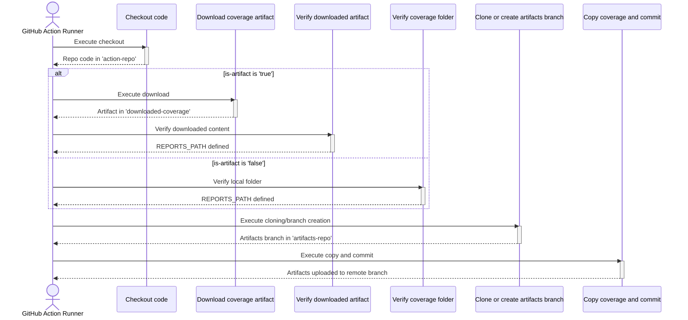

# Git Archive Action

## Languages
- [English](README.md)
- [Spanish](README.es.md)

## 📘 1. What does this Action do?

This GitHub Action is designed to persist workflow artifacts, such as test coverage reports, in a dedicated Git branch within the same repository. Its main purpose is to decouple artifact storage from the main code history, maintaining a historical and accessible record of the results from each execution.

### Technical operation:

**Report Acquisition:** The Action can obtain reports in two different ways, controlled by the `is-artifact` input:

- **From a local folder:** If `is-artifact` is `false`, the Action searches for reports in a specific path within the runner's workspace.
- **From a GitHub artifact:** If `is-artifact` is `true`, the Action first downloads a GitHub artifact (previously uploaded in a previous job) that contains the reports.

**Artifacts Branch Management:** The Action interacts with a specific branch (default `artifacts`):

- If the branch doesn't exist in the remote repository, it creates it as an orphan branch (with no common history with other branches) and adds an initial commit.
- If the branch already exists, it clones it in an isolated directory.

**Structured Storage:** Once it has the reports and the artifacts branch ready, the Action copies the report files within the cloned branch, following a folder structure organized by branch and commit:

- `{source-branch-name}/{commit-hash}/`: Stores a historical copy of the artifacts for that specific commit.
- `{source-branch-name}/latest/`: Stores a copy that always reflects the latest artifacts generated for that branch.

**Commit and Push:** Finally, it performs a commit with all the new artifacts and pushes it to the remote artifacts branch.

This mechanism is useful in CI/CD scenarios for storing and visualizing the evolution of code quality (coverage, tests, etc.) without saturating the main source code history.

## ⚙️ 2. Required Inputs

The following are the input parameters that the Action uses.

| Input name | Required? | Default value | Technical description |
|------------|-----------|---------------|----------------------|
| `gh-token` | ✅ | N/A | GitHub token (GITHUB_TOKEN) with write permissions to clone and push to the artifacts branch. |
| `artifacts-branch` | ❌ | `artifacts` | The name of the Git branch that will be used to store the artifacts. |
| `coverage-source` | ❌ | `coverage-reports` | If `is-artifact` is `false`, it's the path to the folder containing the reports. If `true`, it's the name of the GitHub artifact to download. |
| `is-artifact` | ❌ | `false` | A boolean (true/false) indicating how to interpret `coverage-source`. If `true`, an artifact is downloaded. If `false`, a local folder is copied. |

## 🔑 3. Required Permissions

For this Action to be able to push to the artifacts branch, the workflow that uses it must have write permissions on the repository content. You must add the following `permissions` block at the beginning of your workflow file:

```yaml
permissions:
  contents: write
```

## 📈 4. Step-by-step sequence diagram

The following diagram illustrates the execution flow of the Action, showing the conditional logic for handling reports.



## 🧠 5. Detailed algorithm

The following describes the process that the Action performs, step by step.

### 1. Checkout code

Uses the `actions/checkout@v3` action to clone the current repository into a subfolder called `action-repo`.

### 2. Download coverage artifact

**Condition:** This step only executes if `inputs.is-artifact` is `'true'`.

Uses the `actions/download-artifact@v4` action to download the artifact whose name matches `inputs.coverage-source`.

The artifact content is saved in a new folder called `downloaded-coverage`.

### 3. Verify downloaded coverage artifact / Verify coverage folder

One of these two steps is executed depending on the value of `inputs.is-artifact`.

- **If `true`:** Verifies that the `downloaded-coverage` folder is not empty. If valid, exports the absolute path to this folder to the `REPORTS_PATH` environment variable.
- **If `false`:** Verifies that the folder specified in `inputs.coverage-source` exists within the workspace and is not empty. If valid, exports its absolute path to the `REPORTS_PATH` environment variable.

If any of the folders doesn't exist or is empty, the Action fails.

### 4. Clone or create the artifacts branch

- Configures Git credentials to act as a bot (`github-actions[bot]`).
- Uses `git ls-remote` to verify if the branch defined in `inputs.artifacts-branch` already exists in the remote repository.

**If the branch exists:** Clones it (only that branch) into a new directory called `artifacts-repo`.

**If the branch doesn't exist:**
- Creates the `artifacts-repo` directory and initializes a new Git repository inside.
- Creates an orphan branch (`--orphan`) with the specified name.
- Performs an initial empty commit to be able to push.
- Adds the origin remote and pushes to create the branch in the remote repository.

### 5. Copy coverage and commit

- Verifies that the `REPORTS_PATH` variable was defined correctly in previous steps.
- Positions itself inside the `artifacts-repo` folder.
- Creates the destination directory structure: `./${BRANCH_NAME}/${COMMIT_ID}` and `./${BRANCH_NAME}/latest`.
- Recursively copies all content from the source folder (`REPORTS_PATH`) to both newly created destination folders.
- Creates or overwrites a `README.md` file in the root of `artifacts-repo`.
- Adds all new and modified files to Git's staging area (`git add .`).
- Performs a `git commit` with a descriptive message that includes the commit hash and branch name that originated the artifacts.
- Finally, executes `git push` to upload all changes to the remote artifacts branch.

## 🚀 6. Usage Examples
Below are two common usage scenarios, explained in detail to facilitate their implementation.

### Example 1: Save Reports from a Local Folder
This is the simplest case. The workflow runs tests, generates coverage reports in a folder, and within the same job, uses this Action to upload that folder to the artifacts branch.

#### Workflow Configuration
```yaml
name: CI with Coverage Reports

on:
  push:
    branches:
      - main

# 1. Permissions
permissions:
  contents: write

jobs:
  # 2. Job Definition
  test-and-save-coverage:
    runs-on: ubuntu-latest
    steps:
      # 3. Code Checkout
      - name: Checkout code
        uses: actions/checkout@v3

      # 4. Report Generation (simulated)
      - name: Generate coverage reports
        run: |
          mkdir -p coverage-reports
          echo "<h1>Coverage: 100%</h1>" > coverage-reports/index.html

      # 5. Using the Action to save reports
      - name: Save Coverage Reports
        uses: ronihdzz/git-archive-action@v3
        with:
          gh-token: ${{ secrets.GITHUB_TOKEN }}
          coverage-source: 'coverage-reports'
          is-artifact: 'false'
```

#### Detailed Explanation
- **permissions**: Sets `contents: write` at the workflow level. This is mandatory to grant the `GITHUB_TOKEN` write permissions (push) to the repository, which is what our Action needs to upload the artifacts branch.

- **jobs: test-and-save-coverage**: Defines a single job that will run on an `ubuntu-latest` runner.

- **Checkout code**: The first step is always to clone the repository code to the runner so subsequent steps can work with it.

- **Generate coverage reports**: This `run` step simulates the testing process. This is where your actual command would go (e.g., `npm test -- --coverage`, `pytest --cov`, etc.). The important result is that a folder called `coverage-reports` is created with the report (in this case, an `index.html`).

- **Save Coverage Reports**: This is where our Action is executed.
  - `uses`: You must replace `your-username/your-action-repo@v1` with the correct reference to your Action.
  - `with`: Configures the Action inputs:
    - `gh-token: ${{ secrets.GITHUB_TOKEN }}`: Securely passes the GitHub token. This token already has the write permissions we defined in step 1.
    - `coverage-source: 'coverage-reports'`: Tells the Action that the source of reports is the `coverage-reports` folder, the same one we created in the previous step.
    - `is-artifact: 'false'`: Tells the Action not to download any artifact, but to look for a local folder at the path specified in `coverage-source`.

### Example 2: Save Reports from a GitHub Artifact
This scenario is more complex and is used when reports are generated in one job and need to be consumed in another. The first job generates the reports and uploads them as a "temporary artifact" from GitHub. The second job depends on the first, downloads that artifact, and then uses our Action to save it permanently to the branch.

#### Workflow Configuration
```yaml
name: CI with Coverage Artifacts

on:
  push:
    branches:
      - main

permissions:
  contents: write

jobs:
  # 1. First Job: Generate and upload artifact
  build-and-test:
    runs-on: ubuntu-latest
    steps:
      - name: Checkout code
        uses: actions/checkout@v3

      - name: Generate reports
        run: |
          mkdir -p reports
          echo "<h1>Coverage Report</h1>" > reports/index.html
          
      - name: Upload coverage artifact
        uses: actions/upload-artifact@v4
        with:
          name: coverage-artifact
          path: reports/

  # 2. Second Job: Save the artifact to the branch
  save-artifacts:
    runs-on: ubuntu-latest
    needs: build-and-test # 3. Job dependency
    steps:
      - name: Save Coverage Artifact to Branch
        uses: ronihdzz/git-archive-action@v3
        with:
          gh-token: ${{ secrets.GITHUB_TOKEN }}
          coverage-source: 'coverage-artifact'
          is-artifact: 'true'
          artifacts-branch: 'coverage-history'
```

#### Detailed Explanation
- **jobs: build-and-test**: This is the first job. Its sole responsibility is to generate the reports and upload them as a GitHub artifact.
  - **Upload coverage artifact**: This key step uses the official `actions/upload-artifact@v4` action.
    - `name: coverage-artifact`: We give the artifact a unique name. This name is crucial, as we'll use it to download it later.
    - `path: reports/`: We specify the folder we want to upload.

- **jobs: save-artifacts**: This is the second job, where our Action is used.
  - `needs: build-and-test`: This line is fundamental. It tells GitHub Actions that the `save-artifacts` job should not start until the `build-and-test` job has completed successfully. This ensures the artifact already exists before we try to download it.
  - **Save Coverage Artifact to Branch**: The only step in this job is to call our Action.
    - `uses`: The reference to your Action.
    - `with`:
      - `gh-token`: The token is passed as in the previous example.
      - `coverage-source: 'coverage-artifact'`: Here's the magic! The value we pass is the same name we gave the artifact in the previous job (`name: coverage-artifact`). Our Action will know it needs to search for and download an artifact with that name.
      - `is-artifact: 'true'`: We explicitly tell the Action that `coverage-source` is the name of an artifact to download, rather than a local folder.
      - `artifacts-branch: 'coverage-history'`: This is an example of how you can override the default branch name (`artifacts`) to use a custom one.
